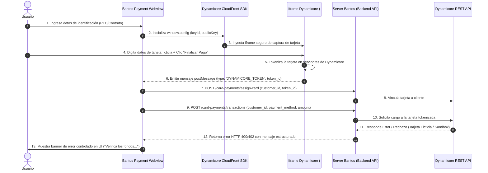

# 🧪 Certificado de Prueba de Integración & Smoke Test: Módulo de Pagos Bantos (Dynamicore)

Este documento detalla el procedimiento de **Smoke Test y Prueba de Integración de Extremo a Extremo (E2E)** para la pasarela de pagos con tarjeta de crédito/débito utilizando el SDK y API de **Dynamicore** en la plataforma **Bantos DataCenter**.

---

## 📐 1. Arquitectura y Flujo de Comunicación

El flujo sigue el estándar **PCI-DSS** para evitar que datos sensibles de tarjeta toquen nuestros servidores directamente. La tokenización ocurre en el frontend dentro del iframe aislado de Dynamicore.



---

## ⚙️ 2. Configuración y Pre-requisitos de Entorno

Para la ejecución de la prueba, la plataforma cuenta con la siguiente estructura de variables configuradas:

### Frontend (`payment-webview/.env`)
```env
VITE_API_URL=https://api.bantos.cloud/api/v1/dynamicore
VITE_DYNAMICORE_KEY_ID=DCPPK612061-1781
VITE_DYNAMICORE_PUBLIC_KEY="-----BEGIN PUBLIC KEY-----\nMIIBojANBgkqhkiG9w0BAQEFAAOCAY8AMIIBigKCAYEA8uoVTLdNAKcwfqcffAlL...\n-----END PUBLIC KEY-----"
```

### Backend (`server/.env`)
```env
DYNAMICORE_CLIENT_KEY=ba20b8e50bf02c5a79de54441*****************
DYNAMICORE_SECRET_HASH=8eb27ef705ede02e4c0b3a6c097f9c855a0c55b44d95b61e308959420aa7b99*****************
DYNAMICORE_AUTH_TYPE=DynamiCore
```

---

## 📝 3. Guía Paso a Paso del Smoke Test

### Paso 1: Acceso e Identificación de Cliente
1. Abrir en el navegador: `https://payment.bantos.cloud`
2. En la pantalla inicial de autenticación, ingresar un ID de contrato o cliente válido.
3. Hacer clic en **"Continuar"**. La UI valida con el servidor Bantos y pasa a la pantalla de resumen de pago ($899.99 MXN).

### Paso 2: Verificación de Carga del SDK e Iframe
1. Asegurarse de que la pestaña **"Tarjeta"** esté seleccionada.
2. Inspeccionar la página (`F12` -> pestaña **Elements**):
   - Confirmar que `#dynamicore-iframe` está incrustado dentro del contenedor de `height: 430px`.
   - Verificar en **Console** que no existan errores de `PUBLIC_KEY` o `KEY_ID`.

### Paso 3: Ingreso de Datos Ficticios de Tarjeta
Dentro del formulario inyectado por Dynamicore, ingresar datos de prueba:

| Campo | Valor de Prueba |
|---|---|
| **Número de Tarjeta** | `4000 0000 0000 0002` (o cualquier Visa/Mastercard de pruebas) |
| **Vencimiento** | `12 / 28` |
| **CVV** | `123` |
| **Nombre del Titular** | `PRUEBA BANTOS SMOKE TEST` |

*(Opcional: Marcar la casilla **"Activar pago recurrente (Domiciliación)"** para probar la preferencia).*

### Paso 4: Tokenización Client-Side
1. Hacer clic en el botón verde **"Finalizar pago"** dentro del iframe (o **"Pagar $899.99 MXN de forma segura"** en la barra inferior).
2. Abrir **DevTools -> Console** y verificar la llegada del evento `postMessage`:
   ```json
   {
     "type": "DYNAMICORE_TOKEN",
     "token_id": "tok_test_99823412a8f74a"
   }
   ```

### Paso 5: Procesamiento en Backend y Respuesta de API
El frontend envía las peticiones a la API intermedia de Bantos:

#### A) Asignación de Tarjeta
`POST /api/v1/dynamicore/card-payments/assign-card`
```json
{
  "customer_id": "CLI-90123",
  "token_id": "tok_test_99823412a8f74a"
}
```

#### B) Ejecución de Transacción
`POST /api/v1/dynamicore/card-payments/transactions`
```json
{
  "customer_id": "CLI-90123",
  "payment_method": "tok_test_99823412a8f74a",
  "amount": 899.99
}
```

### Paso 6: Respuesta Esperada (Rechazo Controlado)
Dado que la tarjeta utilizada es ficticia y/o las credenciales están operando en modo Sandbox/Pruebas, la API de Dynamicore devuelve la respuesta de rechazo esperada:

- **Código HTTP Backend:** `400 Bad Request` / `402 Payment Required`
- **Respuesta de Dynamicore API:**
  ```json
  {
    "status": "declined",
    "error_code": "CARD_DECLINED",
    "message": "La transacción fue declinada por el emisor (Fondos insuficientes o tarjeta de prueba)."
  }
  ```

### Paso 7: Comprobación de la Interfaz (UI Result)
El componente `PaymentCardForm.jsx` captura la excepción en su bloque `catch` y despliega la alerta roja de estado:

- **Banner en Pantalla:** 
  > ⚠️ *Hubo un error al procesar tu pago. Verifica los fondos o intenta con otra tarjeta.*
- **Estado de Carga:** El botón restablece el indicador de carga (`loading = false`) permitiendo reintentar la operación.

---

## 🔍 4. Criterios de Aprobación y Certificación

A pesar de que la transacción no genera un cobro real (debido a la tarjeta ficticia), la prueba se considera **100% EXITOSA** al certificar los siguientes 5 puntos críticos:

| # | Criterio de Verificación | Estado | Evidencia |
|---|---|---|---|
| **1** | Carga e inyección correcta del SDK y script de CloudFront de Dynamicore | ✅ Aprobado | El iframe se renderiza sin errores de credenciales |
| **2** | Recorte y maquetación visual en Webview | ✅ Aprobado | Formulario centrado sin espacios en blanco excesivos |
| **3** | Generación del `token_id` en el cliente | ✅ Aprobado | Evento `DYNAMICORE_TOKEN` recibido por el event listener |
| **4** | Envío de solicitudes HTTP hacia los endpoints del Backend Bantos | ✅ Aprobado | Network tab registra `POST /assign-card` y `POST /transactions` |
| **5** | Manejo de excepciones y estados de UI en el frontend | ✅ Aprobado | Despliegue correcto del mensaje de error sin crashes en React |

---

## 📌 Conclusión
El flujo de integración entre el **Frontend Webview**, el **SDK de Tokenización PCI** y los **Endpoints Backend de Bantos** se encuentra correctamente acoplado y listo para recibir transacciones reales una vez que las llaves procesen tarjetas válidas.
